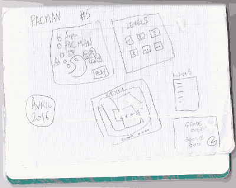

# Superpowers Game Development Series #5 Super Pacman
## **Game Devlog**

### **07/04/2016**

* Today I fixed the pacman movement.
* The pacman can also eat coins and earn points from them.


### **06/04/2016**

* I changed my mind with the objects positions on the level, now I do a layer that I won't erase and keep as a reference each time I start the level. 
In game this layer is simply hidden by the background layer.

* I added the HUD (position of sprite in scene only) with the pacman lifes and fruits than I forgot yesterday.

* I also started to write the pacman movement and I struggle a bit with it. What I try to do is to check on the tileMap each tile on the position next to the pacman position.
I will try tomorrow to fix a bug with the collision movements or change my method.


* Now I can just call once a set function and it will do all the level preparation with the position layer :

```ts  
  start() {
    Level.set();
  }
  
  [...]
  
  export function set(){
    setPacman();
    setGhosts();
    setCoins();
    getFruitsRandomPositions();
  }
```

### **05/04/2016**

Today I started the game from scratch with superpowers, on my previously games I did the menu at the end and found that it was bringing me little issues to solve when I had to polish the game, 
so this time I set the start screen menu directly, even if it doesn't do anything else than jump to the game scene when I press the Space key. 

Doing the start screen is also an opportunity to think about the general art design of the game, I start with this colors palette and will improve it from this base.


From here I can work on the menu and the game in the same time as my need appears.

I also started to make a template level test with the dev tile set. This will be good enough art to start to code the game logic.


With a checking of tile on the Map, I can already set the positions of the Pacman, Coin and Ghosts actor to their starting position. This simple script allow me to build differents 
levels in the editor and automatically place all the objects on the map dynamically. It erase the tiles that I use for level design and replace it with the game actors. 


```ts
  function checkMap(layer?:number, tile?:number){
    for(let x = 0; x < size.width; x++){
      for(let y = 0; y < size.height; y++){
        if(Global.game.tileMap.getTileAt(layer, x, y) === tile){
          // Sup.log("tile", tile, "is in position :", x, y, "of layer", layer);
          return new Sup.Math.Vector2(x, y);
        }
      }
    }
  }
  
  function eraseTile(layer:number, x:number, y:number){
      Global.game.tileMap.setTileAt(layer, x, y, -1);
  }
  
  // function that get the start position of pacman on the map
  export function setPacman(){
    let position;
    position = checkMap(layers.objects, tiles.pacman);
    // Erase pacman start tile
    // Global.game.tileMap.setTileAt(3, position.x, position.y, -1);
    eraseTile(layers.objects, position.x, position.y )
    Global.pacman.position = position;
  }
  
  // function that get the start ghost positions on the map
  export function setGhosts(){
    // Loop 4 times for the 4 ghosts
    for(let ghostIndex = 0; ghostIndex < 4; ghostIndex++){
      let position;
      position = checkMap(layers.objects, tiles.ghost);
      // Erase current ghost start tile
      // Global.game.tileMap.setTileAt(3, position.x, position.y, -1);
      eraseTile(layers.objects, position.x, position.y )
      // Set this position to the ghost of index ghostIndex
      Global.ghosts[ghostIndex].position = position;
    }
  }
  // function that replace the coin on level by coin actors, and count them
  export function setCoins(){
    for(let x = 0; x < size.width; x++){
      for(let y = 0; y < size.height; y++){
        if(Global.game.tileMap.getTileAt(layers.objects, x, y) === tiles.coin){
          Global.coins.small++
          let coin = new Sup.Actor("smallCoin");
          coin.setPosition(x, y, 10);
          new Sup.SpriteRenderer(coin, "Items/SmallCoin/Sprite");
          // Here create actor smallCoin with the position and sprite ..
          Global.coinsList.small.push(coin);
         // Erase current coin start tile
         // Global.game.tileMap.setTileAt(3, x, y, -1);
        eraseTile(layers.objects, x, y);
        }
        else if(Global.game.tileMap.getTileAt(layers.objects, x, y) === tiles.bigcoin){
          Global.coins.big++
          let coin = new Sup.Actor("bigCoin");
          coin.setPosition(x, y, 10);
          new Sup.SpriteRenderer(coin, "Items/BigCoin/Sprite");
          // Here create actor bigCoin with the position and sprite ..
          Global.coinsList.big.push(coin);
         // Erase current coin start tile
         // Global.game.tileMap.setTileAt(3, x, y, -1);
        eraseTile(layers.objects, x, y);
        }
      }
    }
  }
```

### **04/04/2016**

I am starting today the development of Pacman with superpowers, I believe it will take me between 3 weeks and 1 month to build the complete game with assets and the tutorial gitbook.

Today, I mostly explored and rewrote the sparkinlab [code](https://github.com/superpowers-extra/pac-man-like-game) to find out inspiration and a global view before to start the clone.

I also draw on paper a **quick draft** of what I want, a game start screen, a level selection screen, the game itself with the level selected and a game over screen with the score.

  

I already know there will be the classic pacman and the 4 ghosts, the coins and somes fruits.

I won't need to think much about the design of the game, I will do my best to clone the original from memory and follow my own idea in the same time, we will see where it is going.

I also started today a remake of the classic sprites, nothing fancy, I just need the shapes for now as it will help me to build the levels and game structure first.

 

It is a simple test made with the map editor of superpowers, no logic yet, I will improve the sprites as long this development go forward.
