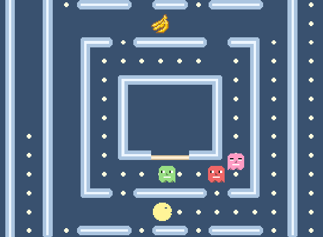
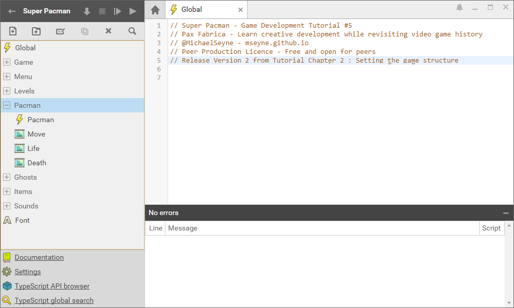
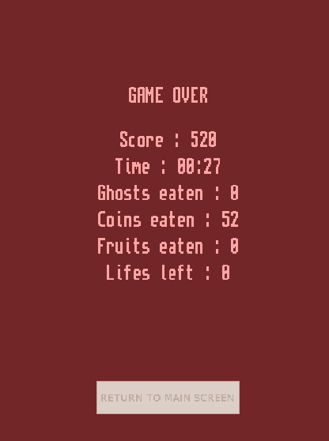
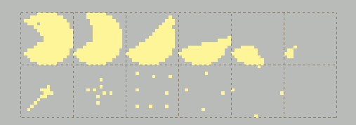
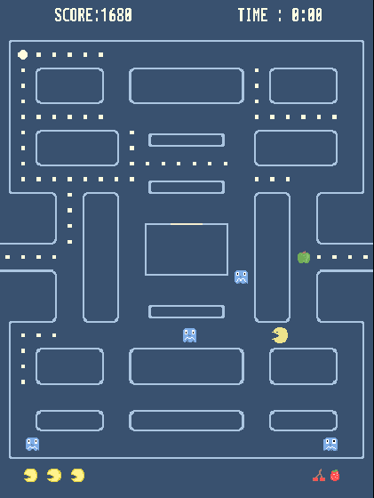
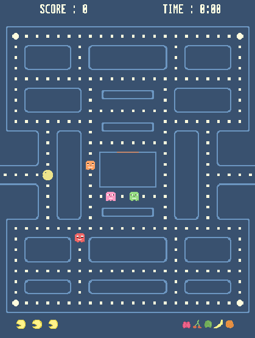

# Superpowers Game Development Series #5 
## **Super Pacman Game Devlog**

### **26/04/2016**
* I wrote the [Chapter 10 : Scripting ghost and fruit behaviors](ch10.md) and release the v10 of the project [here](https://github.com/mseyne/super-pacman-project).
* Final Release :

### **22/04/2016**
* I wrote the [Chapter 8 : Scripting level and start](ch8.md) and release the v8 of the project [here](https://github.com/mseyne/super-pacman-project).
* I wrote the [Chapter 9 : Scripting pacman behavior](ch9.md) and release the v9 of the project [here](https://github.com/mseyne/super-pacman-project).

### **21/04/2016**
* I wrote the [Chapter 6 : Scripting global game behavior](ch6.md) and release the v6 of the project [here](https://github.com/mseyne/super-pacman-project).
* I wrote the [Chapter 7 : Scripting menu behavior](ch7.md) and release the v7 of the project [here](https://github.com/mseyne/super-pacman-project).

### **19/04/2016**

* I wrote the [Chapter 5 : Composing the scenes](ch5.md) and release the v5 of the project [here](https://github.com/mseyne/super-pacman-project).

### **18/04/2016**

* I wrote the [Chapter 4 : Designing the levels](ch4.md) and release the v4 of the project [here](https://github.com/mseyne/super-pacman-project).
* I polished the tileset.

* I made all the levels.

### **16/04/2016**

* I wrote the [Chapter 3 : Setting the assets](ch3.md) and release the v3 of the project [here](https://github.com/mseyne/super-pacman-project).
* I also polished all the sprites, will finish the tileset with the chapter 4 tomorrow.

### **14/04/2016**

* I wrote the [Chapter 2 : Setting the project structure](ch2.md) and released the v2 of the project [here](https://github.com/mseyne/super-pacman-project).

### **13/04/2016**

* Today I start the tutorial from a second build of the Game. The reason why I start again from scratch is that I can build it as I write the tutorial and I will do release of the game by chapter.
To see the evolution as we follow the tutorial.

* I wrote the [Chapter 1 : Planning the game](ch1.md).

### **12/04/2016**

* Victory and game over screen with game statistics added.

* The ghosts are now blinking before to get back vulnerability.

* I have built some more levels patterns and also improved the wall tiles and made some variants.

* I did sounds and music for the game.

### **11/04/2016**

* Today I mostly did some bug fixes and added the game timer.

### **10/04/2016**

* The hud update when pacman lose one life.

* The pacman death animation is added.

#### Menu levels selection

* I worked on the menu screens, added levels buttons and selection system.

### **09/04/2016**

* The pacman now eat fruits that appear randomly and got the score displayed in the position where the fruit was.

* When the pacman eat a big coin, the ghosts become vulnerable for a certain amount of time. Still need to add a blinking when the ghost come back to normal.

* The pacman can eat ghost or be eaten and loose one life, just need to update HUD.

* The ghosts go in jail when eaten (*I have not done the eye track back until jail from the original pacman, too lazy*).

### **08/04/2016**

* I added the Ghosts behavior, they are now moving on the map randomly. I also improved the ghost sprite and animation (eyes looking in the current direction)

* There is a kind of timer when they stay in jail and when they can go through the door after this timer. There is a random timer when the game start to not let them go in the same time.

### **07/04/2016**

* Today I fixed the pacman movement, what was important to find out was a way to keep access to a grid based coordinate that I could use to check the tiles and I get rid of the float numbers
multiplying position by ten to make operation and dividing by ten to get back coordinates, it is less messy this way (thanks sparkinlabs code source for the idea).
* The pacman can also eat coins and earn points from them.

### **06/04/2016**

* I changed my mind with the objects positions on the level, now I do a layer that I won't erase and keep as a reference each time I start the level. 
In game this layer is simply hidden by the background layer.

* I added the HUD (position of sprite in scene only) with the pacman lifes and fruits than I forgot yesterday.

* I also started to write the pacman movement and I struggle a bit with it. What I try to do is to check on the tileMap each tile on the position next to the pacman position.
I will try tomorrow to fix a bug with the collision movements or change my method.

* Now I can just call once a set function and it will do all the level preparation with the position layer.

### **05/04/2016**

Today I started the game from scratch with superpowers, on my previously games I did the menu at the end and found that it was bringing me little issues to solve when I had to polish the game, 
so this time I set the start screen menu directly, even if it doesn't do anything else than jump to the game scene when I press the Space key. 

Doing the start screen is also an opportunity to think about the general art design of the game, I start with this colors palette and will improve it from this base.

From here I can work on the menu and the game in the same time as my need appears.

I also started to make a template level test with the dev tile set. This will be good enough art to start to code the game logic.

With a checking of tile on the Map, I can already set the positions of the Pacman, Coin and Ghosts actor to their starting position. This simple script allow me to build differents 
levels in the editor and automatically place all the objects on the map dynamically. It erase the tiles that I use for level design and replace it with the game actors. 

### **04/04/2016**

I am starting today the development of Pacman with superpowers, I believe it will take me between 3 weeks and 1 month to build the complete game with assets and the tutorial gitbook.

Today, I mostly explored and rewrote the sparkinlab [code](https://github.com/superpowers-extra/pac-man-like-game) to find out inspiration and a global view before to start the clone.

I also draw on paper a **quick draft** of what I want, a game start screen, a level selection screen, the game itself with the level selected and a game over screen with the score.

  

I already know there will be the classic pacman and the 4 ghosts, the coins and somes fruits.

I won't need to think much about the design of the game, I will do my best to clone the original from memory and follow my own idea in the same time, we will see where it is going.

I also started today a remake of the classic sprites, nothing fancy, I just need the shapes for now as it will help me to build the levels and game structure first.

 

It is a simple test made with the map editor of superpowers, no logic yet, I will improve the sprites as long this development go forward.
