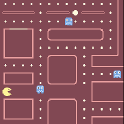

# Superpowers Game Development Series #5
## **SUPER PACMAN**  
### **Chapter 1 : Planning the game**

#### Game introduction

For this tutorial, we will build [Pacman][1], a game released in 1980 and developped by Namco.

The game consist of mazes in which the player move around and try to eat every coins and fruits while
in the same time try to avoid the ghosts moving also in the maze. 

The player can invert the ghost situation by eating a big coin which make the ghosts vulnerable and can be eaten by the player.

#### Features of the game

- A game menu, with level selection to start the maze we want.
- Moving the pacman in a maze, eating coins and fruits give points.
- Four ghosts moving randomly in the level and eating the player if contact.
- Big coin turning ghost as food for the player. They can be eaten and give points.
- Starting location for the ghost in a jail. They return to it each time they are eaten by the player.
- Display score from coin, fruits and eating ghost. Display a game timer. (no limit of time)
- Player got 3 lifes, can eat up to 5 different fruits (which appear randomly in level).
- If player have no more life, game over screen with statistics.
- If player eat all coins, victory screen with statistics.
- Sounds and little music for introduction and end.

#### Gameplay manual 

The player move the pacman with the keyboard arrows, **left**, **up**, **right**, **down**. 

The **mouse** is used to navigate in the menu.

Also at any moment in the game, the player can return to the menu with the **Escape** key or simply restart the current maze with **R** key.

[<-- back to Summary](README.md) -- [go to chapter 2 -->](ch2.md)

[1]: https://en.wikipedia.org/wiki/Pac-Man

