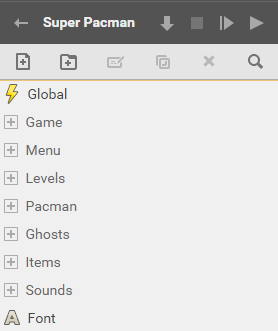
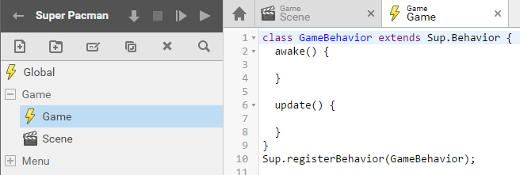
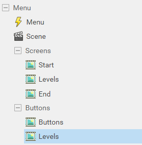
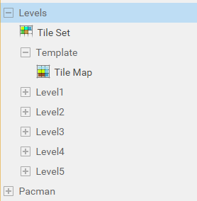
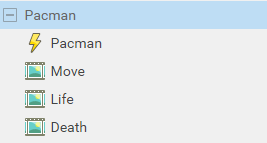
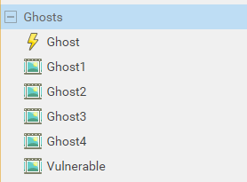
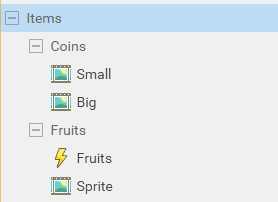
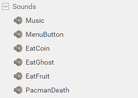

# Superpowers Game Development Series #5
## **SUPER PACMAN**  
### **Chapter 2 : Setting the project structure**

#### Basic structure

When we start with superpowers, one of the first great feature we notice is how easy and great we can structure all the assets of our game in a way that make them easily accessible 
while we develop our game.

As the game become more complex, it is important to keep a logical structure to be able to find out where everything is and not become confused by our own jumble. 

For the first step of our pacman game we create the folders and assets structure. The easier is to see a game like an interaction between objects, big object like the whole game and 
little object like a simple sound. We can separate our game in different folders for each big objects : the ghosts, the pacman, the items, the sounds, the levels, etc.

#### Global script

The global script will contain most of the game datas and global function that we need for all our others script to interact with each other. We make it blank as it won't contain no Class.

* Global (script)

#### Game structure

The game folder contain the scene and script of the game itself. The game script will contain mostly global methods of the game that concern all other objects of the game in runtime like the 
timer, updating the score, checking if the game is won, etc. The game scene is where we combine and place all actors together in the scene editor.

* Game (folder)
   * Game (script)
   * Scene (scene)

#### Menu structure

The Menu folder contain what is related to all the screens that does not concern the game directly like the introduction screen, the level selection to start a new game and the 
victory or game over screens. The Menu script will have the logic of buttons and screens change. The screens and buttons come as different sprites that we set in the Menu scene.

* Menu (folder)
   * Menu (script)
   * Scene (scene)
   * Screens (folder)
      * End (sprite)
      * Start (sprite)
      * Levels (sprite)
   * Buttons (folder)
      * Buttons (sprite)
      * Levels (sprite)
 
     
      
#### Level structure

The Level folder contain all what concern the game mazes, the tileset and each tilemap for each level. The template level will help us for mapping, as we will draw once
 the basic layout of all the maps and then copy it for each level.
 
* Level (folder)
   * Tileset (tile set)
   * Template (folder)
      * Tilemap (tile map)
   * Level1 (folder)
      * // We can let the folder empty as we will copy the Template Tilemap thereafter on which we will map our level.
   * idem for Level2, Level3, etc..

#### Pacman structure

The Pacman folder contain the script and sprites that are related to the character controlled by the player.

* Pacman (folder)
   * Pacman (script)
   * Move (sprite)
   * Life (sprite)
   * Death (sprite)

#### Ghosts structure

The Ghosts folder contain the script and sprites that are related to the characters moving in the mazes as the player try to avoid or eat them.

* Ghosts (folder)
   * Ghost (script)
   * Ghost1 (sprite)
   * Ghost2 (sprite)
   * Ghost3 (sprite)
   * Ghost4 (sprite)
   * Vulnerable (sprite)

#### Items structure

The Items folder contain the objects that the player can interact with.

* Items (folder)
   * Coins (folder)
      * Small (sprite)
      * Big (sprite)
   * Fruits (folder)
      * Fruits (script)
      * Sprite (sprite)
      

#### Sounds structure

The Sounds folder contains all the sounds assets we use in our game.

* Sounds (folder)
   * Music
   * MenuButton
   * EatCoin
   * EatGhost
   * EatFruit
   * PacmanDeath

#### Font

The Font asset is the text we use for our game score and to display others statistics.

* Font (font)

We can download the superpowers project **v0.2** from this chapter [here](https://github.com/mseyne/super-pacman-project).

[<-- go to chapter 1](ch1.md) -- [go to chapter 3 -->](ch3.md)