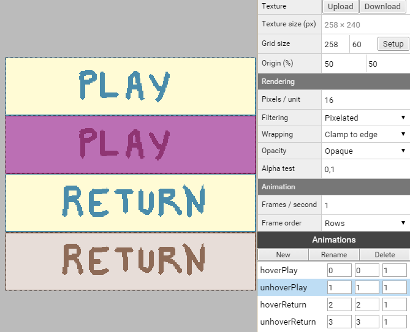
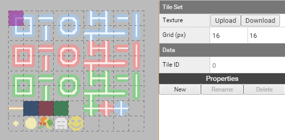

# Superpowers Game Development Series #5
## **SUPER PACMAN**  
### **Chapter 3 : Setting the assets**

*Note : For this chapter concerning assets you can download the sources assets [here](https://github.com/mseyne/superpowers-sources) and continue the tutorial with them or you can decide
to do your own assets from scratch but you should be careful to check than your sprite are the same sizes and placements than the originals to avoid too much change in the code and settings thereafter.*

#### Settings for assets

We have now the structure of our game but the assets are empty, we are going to load each asset file and set them ready to be used in the game scenes.

One decision we need to take in the beginning is the size of our game screen, we decide than one unit will be 16 pixels and the screen will 24 units width and 32 units height.
Which is the same to say than our screen will be 384 width x 512 height with a screen ratio of 3 x 4 in the General settings. 
As we build our levels, we will think with the units, 1 unit = 1 tile = 16x16pixels.

#### Menu assets

We load for each sprite asset the image file related and we set the grids, here the settings for each sprite of the menu folder.

* Menu
   * Screens
      * **Start**, file : menu/startscreen.png, grid size : 600x800, origin : 0x0, pixel/unit : 16
      * **Levels**, file : menu/levelscreen.png, grid size : 600x800, origin : 0x0, pixel/unit : 16
      * **End**, file : menu/endscreen.png, grid size : 600x800, origin : 0x0, pixel/unit : 16
   * Buttons
      * **Buttons**, file : menu/buttons.png, grid size : 258x60, origin : 50x50, pixel/unit : 16
      * **Levels**, file  : menu/levels.png, grid size : 156x184, origin : 50x50, pixel/unit : 16
      
*Note : we change the frames/second to 1 because to slow in maximum the static animation.*
 
##### Start screen    

For the Start screen we create two animations, hover and unhover, with the first and second frames, it is static animations with only one frame each.

* **unhover** with the start and end frame to 0 
* **hover** with the start and end frame to 1

##### End screen

For the End screen we create two animations, victory and gameover, with the first and second frames, it is also static animations with only one frame each.

* **victory** with the start and end frame to 0 
* **gameover** with the start and end frame to 1

##### Buttons

For the buttons we create fours animations for the fours frames.

* **hoverPlay** with the start and end frame to 0 
* **unhoverPlay** with the start and end frame to 1
* **hoverReturn** with the start and end frame to 2 
* **unhoverReturn** with the start and end frame to 3

##### Levels buttons

For the levels buttons we create six animations for the six frames.

* **level1** with the start and end frame to 0 
* **level2** with the start and end frame to 1
* **level3** with the start and end frame to 2 
* **level4** with the start and end frame to 3
* **level5** with the start and end frame to 4
* **level6** with the start and end frame to 5

#### Levels assets

We will see in the next chapter the level design part of our game, for now, we simply add the Tile Set sprite.

* Levels
   * **Tile Set**, file : tileset.png, grid : 16x16px

#### Pacman assets

We load the pacman sprite and set the differents animations :

* Pacman
   * **Move**, file : pacman/move.png, grid size : 16x16, origin : 0x0, pixel/unit : 16
   * **Life**, file : pacman/life.png, grid size : 16x16, origin : 0x0, pixel/unit : 16
   * **Death**, file : pacman/death.png, grid size : 16x16, origin : 0x0, pixel/unit : 16

##### Move animation

For the move animations, we set four animations with 4 frames each.

* **goLEFT** with the start frame at 0 and end frame to 3 
* **goRIGHT** with the start frame at 4 and end frame to 7
* **goUP** with the start frame at 8 and end frame to 11
* **goDOWN** with the start frame at 12 and end frame to 15

##### Life sprites

We set two static animations, one for each frame.

* **full** with the start and end frame to 0 
* **empty** with the start and end frame to 1

##### Death animation

Only one death animation with all the frames of the sprite.

* **death** with the start frame at 0 and end frame to 11 

#### Ghosts assets

The four ghosts have the sames parameters, so we could delete all ghosts assets and start a new one ghost1, set it and duplicate it 3 times with differents sprite file.

* Ghosts
   * **ghost1**, file : ghosts/ghost1.png, grid size : 16x16, origin : 0x0, pixel/unit : 16
   * **ghost2**, file : ghosts/ghost2.png, grid size : 16x16, origin : 0x0, pixel/unit : 16
   * **ghost3**, file : ghosts/ghost3.png, grid size : 16x16, origin : 0x0, pixel/unit : 16
   * **ghost4**, file : ghosts/ghost4.png, grid size : 16x16, origin : 0x0, pixel/unit : 16
   * **vulnerable**, file: ghosts/vulnerable.png, grid size : 16x16, origin : 0x0, pixel/unit : 16

##### move animation

We set four animations with 3 frames each for the four directions, and **we do that 4 times for each ghost** (or we do it for one and duplicate it 3 times).

*Note : we change the frames/second to 5, to make the animation slower.*

* **goLEFT** with the start frame at 0 and end frame to 2 
* **goRIGHT** with the start frame at 3 and end frame to 5
* **goDOWN** with the start frame at 6 and end frame to 8
* **goUP** with the start frame at 9 and end frame to 11

##### vulnerable animation

This sprite is used when the player eat a big coin, it is then possible to eat the ghost, after a time, the ghost start to blink and can eat the player again.

We set four animations with the same 3 frames for the four directions. The fifth animation is the ghost blinking before coming back to normal.

*Note : we change the frames/second to 5, to make the animation slower.*

* **goLEFT** with the start frame at 0 and end frame to 2 
* **goRIGHT** with the start frame at 0 and end frame to 2
* **goDOWN** with the start frame at 0 and end frame to 2
* **goUP** with the start frame at 0 and end frame to 2
* **blink** with the start frame at 3 and end frame to 5

#### Items assets

We add sprite for the small coin, big coin and for the fruits.

* Items
   * Coins
      * Small, grid size : 16x16, origin : 0x0, pixel/unit : 16
      * Big, grid size : 16x16, origin : 0x0, pixel/unit : 16
   * Fruits
      * Sprite, grid size : 16x16, origin : 0x0, pixel/unit : 16
      
##### Fruits sprites

We create static animation to separate each fruit from the Sprite :

*Note : we change the frames/second to 1 because to slow in maximum the static animation.*

* **banana** with the start and end frame to 0 
* **orange** with the start and end frame to 1
* **apple** with the start and end frame to 2
* **cherry** with the start and end frame to 3
* **strawberry** with the start and end frame to 4

#### Sounds assets

For each sound we load the mp3 file related :

* Sounds
   * **Music**, file : sounds/music.mp3
   * **MenuButton**, file : sounds/menu.mp3
   * **EatCoin**, file : sounds/eatcoin.mp3
   * **EatGhost**, file : sounds/eatghost.mp3
   * **EatFruit**, file : sounds/eatfruit.mp3
   * **PacmanDeath**, file : sounds/pacmandeath.mp3

#### Font asset

We load the bitmap font with a grid of 20x20 and a pixel/unit of 20.

We can download the superpowers project **v3** from this chapter [here](https://github.com/mseyne/super-pacman-project).

[<-- go to chapter 2](ch2.md) -- [go to chapter 4 -->](ch4.md)