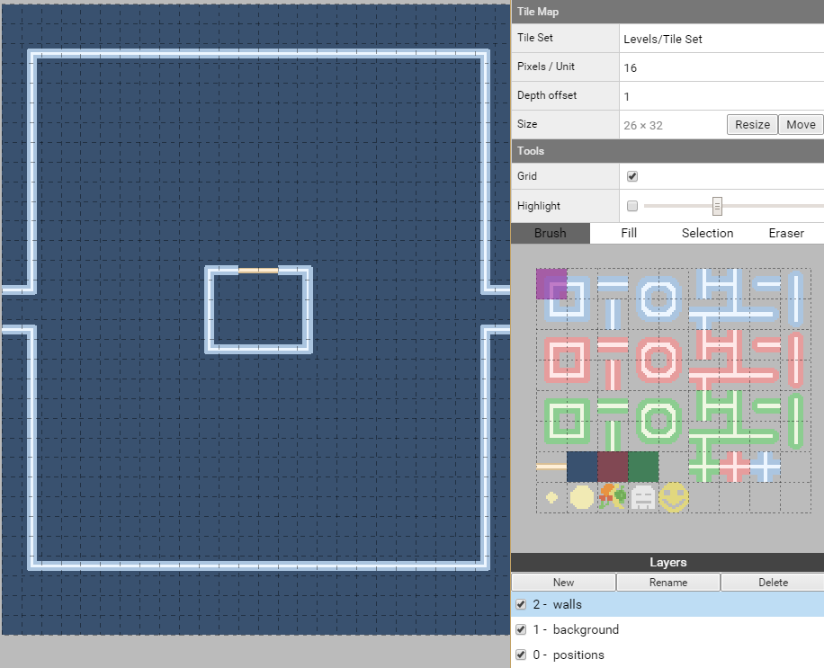
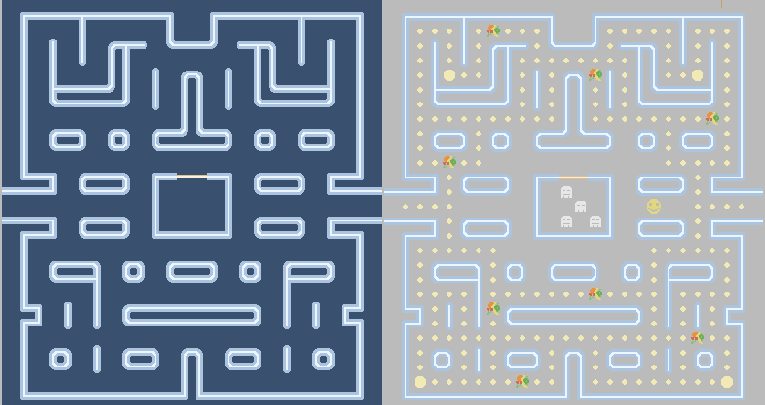
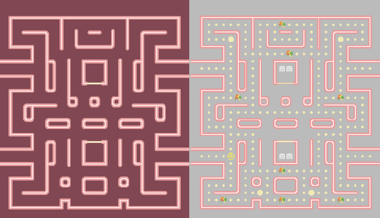
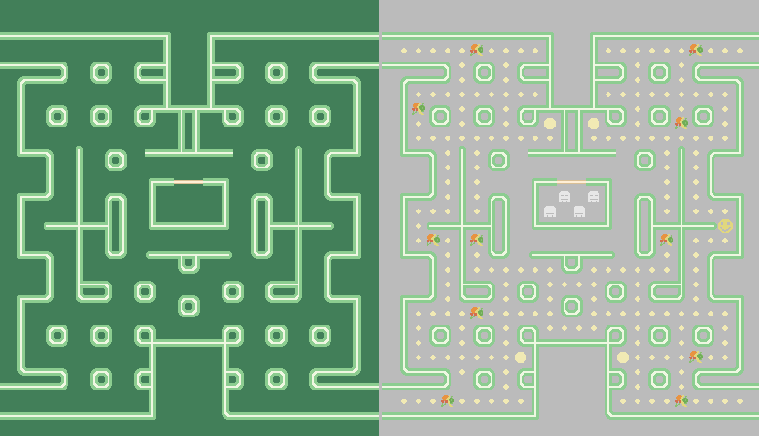
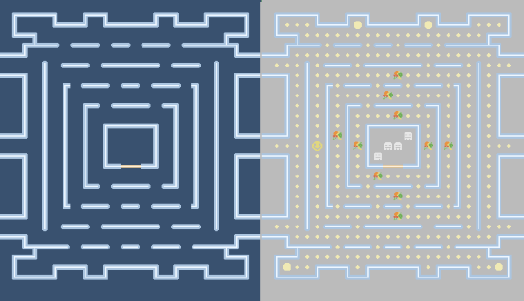
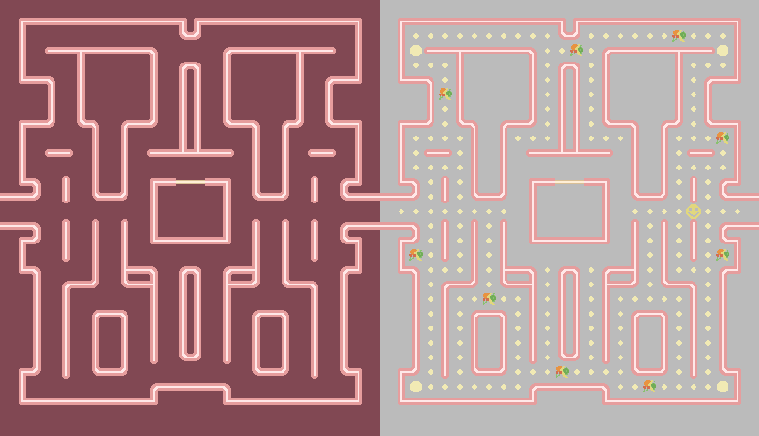

# Superpowers Game Development Series #5
## **SUPER PACMAN**  
### **Chapter 4 : Designing the levels**

The important thing we need now is to build our levels, we will start by mapping a template then we will duplicate each time we start a new level.

We have for now this structure :

* Levels
   * Tile Set
   * Template
      * Tile Map
      
Things to know when mapping a level :

* We need prisons for the ghosts, it can be 4 littles cells or a big one, but we need 4 positions and we also need doors to allow them to go out.
* We need to do closed outside walls in a way than the pacman cannot go out of the map, it would break the game.
* The two margins of one unit on the side won't appear in the game screen, we need to do passage with wall for the pacman to jump to the other side (and no hidden coin).
* Where we place a random position for fruit, the game will start with a little coin and when the coin is taken, this place become a possible place for fruit to appear thereafter.
* We need starting position for the Pacman and for the 4 ghosts. We need positions for all the coins and big bonus coin (4 big coin is recommended).
* All the paths should be one unit large between walls, because the game is made for line displacement and not diagonales.

#### Template level

We will do a template level which mean that its content will be composed of the basics that we won't need to repeat for all our levels. The wall outlines and the layers.

We first check the settings of the Tile Map to have 16 pixel per unit and a size of 26x32 units. And attach the Tileset Levels/Tile Set to the tilemap.  
*Note : 26 of width, but 24 visible unit in the screen. (24x16 = 384px and 32x16 = 512px, ratio 3/4)*

We create 3 layers in this particular order (the background layer need to hide the positions layer when the game running, and the walls need to be above the background):
* **walls**, the map layout
* **background**, the background color of the map
* **positions**, the object position on the map  

#### Level layouts

We now can draw as much map we want, for this game, I will draw five levels using the 3 differents colors, we try differents patterns until we are happy with them.

We Duplicate the template and build the five levels :

* Levels
   * Tile Set
   * Template
      * Tile Map
   * Level1
      * Tile Map
   * Level2
      * Tile Map
   * Level3
      * Tile Map
   * Level4
      * Tile Map
   * Level5
      * Tile Map

Here all the examples patterns, we are free to do however we want :

#### Level 1 layers walls+background & walls+positions

#### Level 2 layers walls+background & walls+positions

#### Level 3 layers walls+background & walls+positions

#### Level 4 layers walls+background & walls+positions

#### Level 5 layers walls+background & walls+positions

We can download the superpowers project **v4** from this chapter [here](https://github.com/mseyne/super-pacman-project).

[<-- go to chapter 3](ch3.md) -- [go to chapter 5 -->](ch5.md)