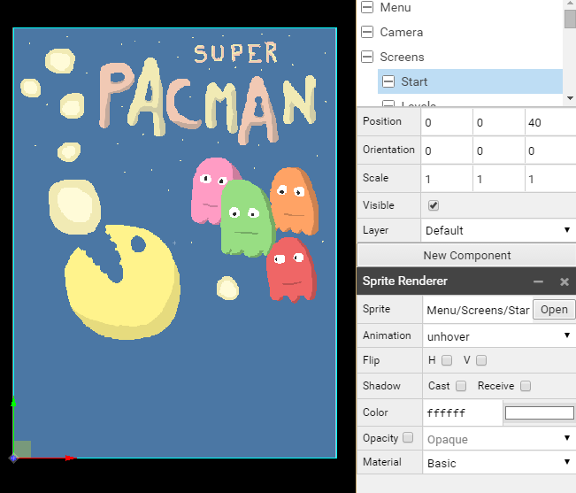
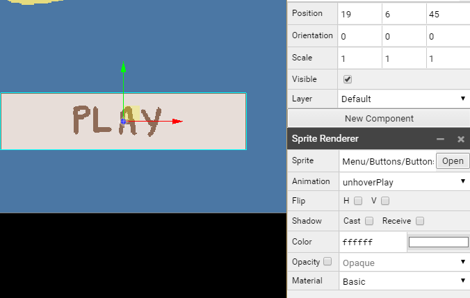

# Superpowers Game Development Series #5
## **SUPER PACMAN**  
### **Chapter 5 : Composing the scenes**

We can now create the scenes of our game, we will compose the visual display of our game and menu while combining objects (actors) together (like camera, level, score, button, etc..)

There is two main scene, the game in which the player take control of the pacman and the menu in which we can choose the level to start.

#### Menu scene

Here the structure of the menu scene actors :

* **Menu**
* **Camera**
* **Screens**
   * Start
   * Levels
      * Level1
      * Level2
      * Level3
      * Level4
      * Level5
      * Level6
   * End
      * Score
      * Time
      * Ghosts
      * Coins
      * Fruits
      * Lifes
* **Button**

##### Menu actor

The Menu actor have the behavior component with the class **MenuBehavior** attached to it.

##### Camera actor

The Camera actor have a camera component attached to it with this parameters.

* Position:**(18.75, 25, 50)** to have the camera centered on the screens pictures and far enough on Z axis(50).
* Mode:**Orthographic** (important for our 2d game)
* Orthographic Scale: **50**

##### Screens actor

We set the different screens with their parameters and positions (Z axis positions only) :

* Start in position **(0, 0, 40)**, a Sprite Renderer component with **Menu/Screens/Start** and animation unhover

* Levels in position **(0, 0, 20)**, a Sprite Renderer component with **Menu/Screens/Levels**
   * Level1 in position **(6.5, 32, 5)**, a Sprite Renderer component with **Menu/Buttons/Levels** with Animation **level1**
   * Level2 in position **(18.8, 32, 5)**, a Sprite Renderer component with **Menu/Buttons/Levels** with Animation **level2**
   * Level3 in position **(31, 32, 5)**, a Sprite Renderer component with **Menu/Buttons/Levels** with Animation **level3**
   * Level4 in position **(6.5, 19, 5)**, a Sprite Renderer component with **Menu/Buttons/Levels** with Animation **level4**
   * Level5 in position **(18.8, 19, 5)**, a Sprite Renderer component with **Menu/Buttons/Levels** with Animation **level5**
   * Level6 in position **(31, 19, 5)**, a Sprite Renderer component with **Menu/Buttons/Levels** with Animation **level6**

* End in position **(0, 0, 0)**, a Sprite Renderer component with **Menu/Screens/End**
   * Score in position **(19, 36, 5)**, a Text Renderer component with the font **Font** and the text **SCORE : 0000**
   * Time in position  **(19, 32, 5)**, a Text Renderer component with the font **Font** and the text **TIME : 00:00**
   * Ghosts in position **(19, 28, 5)**, a Text Renderer component with the font **Font** and the text **Ghosts eaten : 0**
   * Coins in position **(19, 24, 5)**, a Text Renderer component with the font **Font** and the text **Coins eaten : 0**
   * Fruits in position **(19, 20, 5)**, a Text Renderer component with the font **Font** and the text **Fruits eaten : 0**
   * Lifes in position **(19, 16, 5)**, a Text Renderer component with the font **Font** and the text **Lifes : 0**

*Note: You can navigate with the camera in 3D mode or in 2D and changing the Z axis to focus on the screen you are interested to check.*

##### Button actor

The Button actor in position **(19, 6, 45)** has a Sprite Render Component with the sprite **Menu/Buttons/Buttons** and the animation **unhoverPlay**

The menu scene is now complete :

#### Game scene

Here the structure of the game scene actors :

* **Game**
* **Camera**
* **Level**
* **Pacman**
* **Ghosts**
   * 1
   * 2
   * 3
   * 4
* **Fruits**
   * 0
   * 1
   * 2
   * 3
   * 4
* **HUD**
   * Score
   * Timer
   * Lifes
      * 0
      * 1
      * 2

##### Game actor

The Game actor have the behavior component with the class **GameBehavior** attached to it.

##### Camera actor

The Camera actor have a camera component attached to it with this parameters.

* Position:**(13, 16, 50)** to have the camera centered in the center of our maze and far enough on Z axis(50).
* Mode:**Orthographic** (important for our 2d game)
* Orthographic Scale: **32**

##### Level actor

The Level actor in position **(0, 0, 0)** have a Tile Map Renderer component with the **Levels/Template/Tile** Map attached to it.

*Note : It is normal the camera hide two margins of 1 unit (16px large) from the level.* 

##### Pacman actor

The Pacman actor in position **(0, 0, 30)** have two components :

* Behavior with the class **PacmanBehavior**
* Sprite Renderer with the sprite **Pacman/Move**

##### Ghosts actor

The ghosts actor is in position **(0, 0, 20)**, each ghost (1, 2, 3, 4) got two components :

* Behavior with the class **GhostBehavior**
* Sprite Renderer with the sprite **Ghosts/Ghost1** for 1 actor, **Ghosts/Ghost2** for 2 actor, **Ghosts/Ghost3** for 3 actor, **Ghosts/Ghost4** for 4 actor

 

##### Fruits actor

The Fruits actor in position **(0, 0, 10)**, each fruit (0, 1, 2, 3, 4) got two components and this parameters:

* 0 in position **(16, 1, 0)**, a Behavior component with **FruitBehavior** class, a Sprite Renderer with **Items/Fruits/Sprite** and **banana** Animation
* 1 in position **(17.5, 1, 0)**, a Behavior component with **FruitBehavior** class, a Sprite Renderer with **Items/Fruits/Sprite** and **orange** Animation
* 2 in position **(19, 1, 0)**, a Behavior component with **FruitBehavior** class, a Sprite Renderer with **Items/Fruits/Sprite** and **apple** Animation
* 3 in position **(20.5, 1, 0)**, a Behavior component with **FruitBehavior** class, a Sprite Renderer with **Items/Fruits/Sprite** and **cherry** Animation
* 4 in position **(22, 1, 0)**, a Behavior component with **FruitBehavior** class, a Sprite Renderer with **Items/Fruits/Sprite** and **stawberry** Animation

##### HUD actor

The HUD actor in position **(0, 0, 40)**, the score, timer and lifes got this components and parameters :

* Score in position **(7, 31, 0)**, a Text Renderer component with the font **Font**, the text **Score:0000** and a color **fcfee2**
* Timer in position **(19, 31, 0)**, a Text Renderer component with the font **Font**, the text **Time:00:00** and a color **fcfee2**

* Lifes
   * 0 in position **(3, 1, 0)**, a Sprite Renderer with **Pacman/Life** and animation **full**
   * 1 in position **(5, 1, 0)**, a Sprite Renderer with **Pacman/Life** and animation **full**
   * 2 in position **(7, 1, 0)**, a Sprite Renderer with **Pacman/Life** and animation **full**

Our game scene is now complete

We can download the superpowers project **v5** from this chapter [here](https://github.com/mseyne/super-pacman-project).

[<-- go to chapter 4](ch4.md) -- [go to chapter 6 -->](ch6.md)